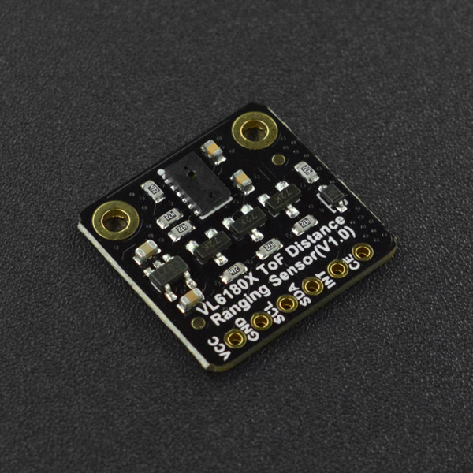

# DFRobot_VL6180X

- [中文版](./README_CN.md)

The VL6180X is the latest product based on ST’s patented FlightSense™technology. This is a ground-breaking technology allowing absolute distance to be measured independent of target reflectance. Instead of estimating the distance by measuring the amount of light reflected back from the object (which is significantly influenced by color and surface), the VL6180X precisely measures the time the light takes to travel to the nearest object and reflect back to the sensor (Time-of-Flight).




## Product Link(https://www.dfrobot.com/product-2287.html)
    SKU：SEN0427

## Table of Contents

* [Summary](#summary)
* [Installation](#installation)
* [Methods](#methods)
* [Compatibility](#compatibility)
* [History](#history)
* [Credits](#credits)
<snippet>
<content>

## Summary

* Measure absolute range from 0 to above 10 cm
* Measurement of ambient light data

## Installation

To use this library, download the library file first, paste it into the \Arduino\libraries directory, then open the examples folder and run the demo in the folder.

## Methods

```C++
   /**
   * @brief  Initialization function
   * @return Whether the device is on or not. return true succeed ;return false failed.
   */
  bool begin();

  /**
   * @brief  Configure the default level of the INT pin and enable the GPIO1 interrupt function
   * @param  mode  Enable interrupt mode
   * @n            VL6180X_DIS_INTERRUPT  disabled interrupt
   * @n            VL6180X_DIS_INTERRUPT  GPIO1 interrupt enabled, INT high by default
   * @n            VL6180X_LOW_INTERRUPT  GPIO1 interrupt enabled, INT low by default
   */
  void setInterrupt(uint8_t mode);

  /**
   * @brief  A single range
   * @return   return ranging data ,uint mm
   */
  uint8_t rangePollMeasurement();

  /**
   * @brief  Configuration ranging period
   * @param  period_ms  Measurement period, in milliseconds
   */
  void rangeSetInterMeasurementPeriod(uint16_t periodMs);

  /**
   * @brief  Configure the interrupt mode for ranging
   * @param  mode  Enable interrupt mode
   * @n              VL6180X_INT_DISABLE                           interrupt disable                   
   * @n              VL6180X_LEVEL_LOW                             value < thresh_low                      
   * @n              VL6180X_LEVEL_HIGH                            value > thresh_high                      
   * @n              VL6180X_OUT_OF_WINDOW                         value < thresh_low OR value > thresh_high
   * @n              VL6180X_NEW_SAMPLE_READY                      new sample ready                      
   */
  bool rangeConfigInterrupt(uint8_t mode);

  /**
   * @brief  Configure the interrupt mode for the ambient light
   * @param  mode  Enable interrupt mode
   * @n              VL6180X_INT_DISABLE                           interrupt disable                   
   * @n              VL6180X_LEVEL_LOW                             value < thresh_low                      
   * @n              VL6180X_LEVEL_HIGH                            value > thresh_high                      
   * @n              VL6180X_OUT_OF_WINDOW                         value < thresh_low OR value > thresh_high
   * @n              VL6180X_NEW_SAMPLE_READY                      new sample ready                      
   */
  bool alsConfigInterrupt(uint8_t mode);

  /**
   * @brief Enable continuous ranging mode
   */
  void rangeStartContinuousMode();

  /**
   * @brief  Retrieve ranging data
   * @return   return ranging data ,uint mm
   */
  uint8_t rangeGetMeasurement();

  /**
   * @brief  Clear the ambient light interrupt
   */
  void clearAlsInterrupt();

  /**
   * @brief  Clear ranging interrupt
   */
  void clearRangeInterrupt();

  /**
   * @brief Single measurement of ambient light
   * @return   return The light intensity,uint lux
   */
  float alsPoLLMeasurement();

  /**
   * @brief  Obtain measured light data
   * @return   return The light intensity,uint lux
   */
  float alsGetMeasurement();

  /**
   * @brief  Enable continuous measurement of ambient light intensity mode
   */
  void alsStartContinuousMode();

  /**
   * @brief  Configure the period for measuring light intensity
   * @param  period_ms  Measurement period, in milliseconds
   */
  void alsSetInterMeasurementPeriod(uint16_t periodMs);

  /**
   * @brief  turn on interleaved mode
   */
  void startInterleavedMode();

  /**
   * @brief  Get the interrupt state of the ranging
   * @return   return status
   * @n             0                        ： No threshold events reported
   * @n             VL6180X_LEVEL_LOW        ：value < thresh_low
   * @n             VL6180X_LEVEL_HIGH       ：value > thresh_high
   * @n             VL6180X_OUT_OF_WINDOW    ：value < thresh_low OR value > thresh_high
   * @n             VL6180X_NEW_SAMPLE_READY ：new sample ready
   */
  uint8_t rangeGetInterruptStatus();

  /**
   * @brief  Get the interrupt state of the measured light intensity
   * @return   return status
   * @n             0                        ： No threshold events reported
   * @n             VL6180X_LEVEL_LOW        ：value < thresh_low
   * @n             VL6180X_LEVEL_HIGH       ：value > thresh_high
   * @n             VL6180X_OUT_OF_WINDOW    ：value < thresh_low OR value > thresh_high
   * @n             VL6180X_NEW_SAMPLE_READY ：new sample ready
   */
  uint8_t alsGetInterruptStatus();

  /**
   * @brief  Get validation information for range data
   * @return Authentication information
   */
  uint8_t getRangeResult();

  /**
   * @brief  set IIC addr
   * @param  addr  The IIC address to be modified
   */
  void setIICAddr(uint8_t addr);

  /**
   * @brief  Set the ALS gain 
   * @param  gain  the value of gain(range 0-7)
   * @n            20   times gain: VL6180X_ALS_GAIN_20       = 0
   * @n            10   times gain: VL6180X_ALS_GAIN_10       = 1
   * @n            5    times gain: VL6180X_ALS_GAIN_5        = 2
   * @n            2.5  times gain: VL6180X_ALS_GAIN_2_5      = 3
   * @n            1.57 times gain: VL6180X_ALS_GAIN_1_67     = 4
   * @n            1.27 times gain: VL6180X_ALS_GAIN_1_25     = 5
   * @n            1    times gain: VL6180X_ALS_GAIN_1        = 6
   * @n            40   times gain: VL6180X_ALS_GAIN_40       = 7
   * @return true :Set up the success, false :Setup failed
   */
  bool setALSGain(uint8_t gain = VL6180X_ALS_GAIN_1);

  /**
   * @brief  Set ALS Threshold Value
   * @param  thresholdL :Lower Threshold
   * @param  thresholdH :Upper threshold
   */
  void setALSThresholdValue(uint16_t thresholdL=0x0000,uint16_t thresholdH=0xFFFF);

  /**
   * @brief  Set Range Threshold Value
   * @param  thresholdL :Lower Threshold
   * @param  thresholdH :Upper threshold
   */
  void setRangeThresholdValue(uint8_t thresholdL=0x00,uint8_t thresholdH=0xFF);

```

## Compatibility

| MCU                | Work Well | Work Wrong | Untested | Remarks |
| ------------------ | :-------: | :--------: | :------: | ------- |
| Arduino Uno        |     √     |            |          |         |
| FireBeetle-ESP8266 |     √     |            |          |         |
| FireBeetle-ESP32   |     √     |            |          |         |
| Arduino MEGA2560   |     √     |            |          |         |
| Arduino Leonardo   |     √     |            |          |         |
| Micro:bit          |     √     |            |          |         |
| FireBeetle-M0      |     √     |            |          |         |
| Raspberry Pi       |     √     |            |          |         |


## History

- data 2021-03-10
- version V1.0


## Credits

Written by [yangfeng]<feng.yang@dfrobot.com>,2021,(Welcome to our [website](https://www.dfrobot.com/))
