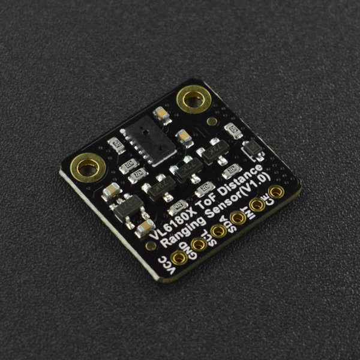

# DFRobot_VL6180X

- [English Version](./README.md)

VL6180X是意法半导体的一款ToF激光测距传感器，可测量5-100mm的距离，但在良好的环境下测量距离可达200mm。VL6180X搭载了意法半导体FlightSense ™技术，可以精确的测量距离，与目标反射率无关。同时VL6180X还搭载了环境光传感器，可以测量出环境光数据。




## 产品链接(https://www.dfrobot.com.cn/goods-3122.html)
    SKU：SEN0427

## 目录

* [概述](#概述)
* [库安装](#库安装)
* [方法](#方法)
* [兼容性](#兼容性)
* [历史](#历史)
* [创作者](#创作者)


## 概述

* 测量距离范围5-100mm
* 环境光数据的测量

## 库安装

要使用这个库，首先下载库文件，将其粘贴到\Arduino\libraries目录中，然后打开示例文件夹并在文件夹中运行演示。


## 方法

```C++
   /**
   * @brief  初始化函数
   * @return 判断设备是否打开。 返回真成功;返回假失败。
   */
  bool begin();

  /**
   * @brief  配置 INT 引脚的默认电平并启用 GPIO1 中断功能
   * @param  mode  启用的中断模式
   * @n            VL6180X_DIS_INTERRUPT  禁用中断
   * @n            VL6180X_DIS_INTERRUPT  启用 GPIO1 中断，默认情况下 INT 为高
   * @n            VL6180X_LOW_INTERRUPT  启用 GPIO1 中断，默认情况下 INT 为低
   */
  void setInterrupt(uint8_t mode);

  /**
   * @brief  轮询测量范围
   * @return   return 范围 ,单位 mm
   */
  uint8_t rangePollMeasurement();

  /**
   * @brief  配置范围周期
   * @param  period_ms  测量周期，以毫秒为单位
   */
  void rangeSetInterMeasurementPeriod(uint16_t periodMs);

  /**
   * @brief  配置用于测距的中断模式
   * @param  mode  启用的中断模式
   * @n              VL6180X_INT_DISABLE                           interrupt disable                   
   * @n              VL6180X_LEVEL_LOW                             value < thresh_low                      
   * @n              VL6180X_LEVEL_HIGH                            value > thresh_high                      
   * @n              VL6180X_OUT_OF_WINDOW                         value < thresh_low OR value > thresh_high
   * @n              VL6180X_NEW_SAMPLE_READY                      new sample ready                      
   */
  bool rangeConfigInterrupt(uint8_t mode);

  /**
   * @brief  配置环境光的中断模式
   * @param  mode  启用的中断模式
   * @n              VL6180X_INT_DISABLE                           interrupt disable                   
   * @n              VL6180X_LEVEL_LOW                             value < thresh_low                      
   * @n              VL6180X_LEVEL_HIGH                            value > thresh_high                      
   * @n              VL6180X_OUT_OF_WINDOW                         value < thresh_low OR value > thresh_high
   * @n              VL6180X_NEW_SAMPLE_READY                      new sample ready                      
   */
  bool alsConfigInterrupt(uint8_t mode);

  /**
   * @brief 启用连续测距模式
   */
  void rangeStartContinuousMode();

  /**
   * @brief  检索测距数据
   * @return   return 测距数据 ,单位： mm
   */
  uint8_t rangeGetMeasurement();

  /**
   * @brief  清除环境光中断
   */
  void clearAlsInterrupt();

  /**
   * @brief  清除测距中断
   */
  void clearRangeInterrupt();

  /**
   * @brief 环境光的单一测量
   * @return   return 光强度，单位： lux
   */
  float alsPoLLMeasurement();

  /**
   * @brief  获取测量的光数据
   * @return   return 光强度，单位： lux
   */
  float alsGetMeasurement();

  /**
   * @brief  支持连续测量环境光强度模式
   */
  void alsStartContinuousMode();

  /**
   * @brief 配置测量光强度的周期
   * @param period_ms 测量周期，以毫秒为单位
   */
  void alsSetInterMeasurementPeriod(uint16_t periodMs);

  /**
   * @brief  打开交错模式
   */
  void startInterleavedMode();

  /**
   * @brief  获取测距的中断状态
   * @return   return status
   * @n             0                        ： No threshold events reported
   * @n             VL6180X_LEVEL_LOW        ：value < thresh_low
   * @n             VL6180X_LEVEL_HIGH       ：value > thresh_high
   * @n             VL6180X_OUT_OF_WINDOW    ：value < thresh_low OR value > thresh_high
   * @n             VL6180X_NEW_SAMPLE_READY ：new sample ready
   */
  uint8_t rangeGetInterruptStatus();

  /**
   * @brief  获取测量光强度的中断状态
   * @return   return 状态
   * @n             0                        ：未报告阈值事件
   * @n             VL6180X_LEVEL_LOW        ：value < thresh_low
   * @n             VL6180X_LEVEL_HIGH       ：value > thresh_high
   * @n             VL6180X_OUT_OF_WINDOW    ：value < thresh_low OR value > thresh_high
   * @n             VL6180X_NEW_SAMPLE_READY ：new sample ready
   */
  uint8_t alsGetInterruptStatus();

  /**
   * @brief  获取范围数据的验证信息
   * @return 验证信息
   */
  uint8_t getRangeResult();

  /**
   * @brief  设置i2c设备地址
   * @param  addr  要修改的 IIC 地址
   */
  void setIICAddr(uint8_t addr);

  /**
   * @brief  设置 ALS 增益
   * @param  gain  增益值（范围0-7）
   * @n            20   倍增益: VL6180X_ALS_GAIN_20       = 0
   * @n            10   倍增益: VL6180X_ALS_GAIN_10       = 1
   * @n            5    倍增益: VL6180X_ALS_GAIN_5        = 2
   * @n            2.5  倍增益: VL6180X_ALS_GAIN_2_5      = 3
   * @n            1.57 倍增益: VL6180X_ALS_GAIN_1_67     = 4
   * @n            1.27 倍增益: VL6180X_ALS_GAIN_1_25     = 5
   * @n            1    倍增益: VL6180X_ALS_GAIN_1        = 6
   * @n            40   倍增益: VL6180X_ALS_GAIN_40       = 7
   * @return true :设置成功, false :设置失败
   */
  bool setALSGain(uint8_t gain = VL6180X_ALS_GAIN_1);

  /**
   * @brief  设置 ALS 阈值
   * @param  thresholdL :下限阈值
   * @param  thresholdH :上限阈值
   */
  void setALSThresholdValue(uint16_t thresholdL=0x0000,uint16_t thresholdH=0xFFFF);

  /**
   * @brief  设置范围阈值
   * @param  thresholdL :下限阈值
   * @param  thresholdH :上限阈值
   */
  void setRangeThresholdValue(uint8_t thresholdL=0x00,uint8_t thresholdH=0xFF);
```


## 兼容性

主控               |  正常运行    |   运行失败    |   未测试    | 备注
| ------------------ | :-------: | :--------: | :------: | ------- |
| Arduino Uno        |     √     |            |          |         |
| FireBeetle-ESP8266 |     √     |            |          |         |
| FireBeetle-ESP32   |     √     |            |          |         |
| Arduino MEGA2560   |     √     |            |          |         |
| Arduino Leonardo   |     √     |            |          |         |
| Micro:bit          |     √     |            |          |         |
| FireBeetle-M0      |     √     |            |          |         |
| Raspberry Pi       |     √     |            |          |         |


## 历史

- 日期 2021-09-28
- 版本 V1.0.0


## 创作者

Written by yangfeng(feng.yang@dfrobot.com), 2021. (Welcome to our [website](https://www.dfrobot.com/))

